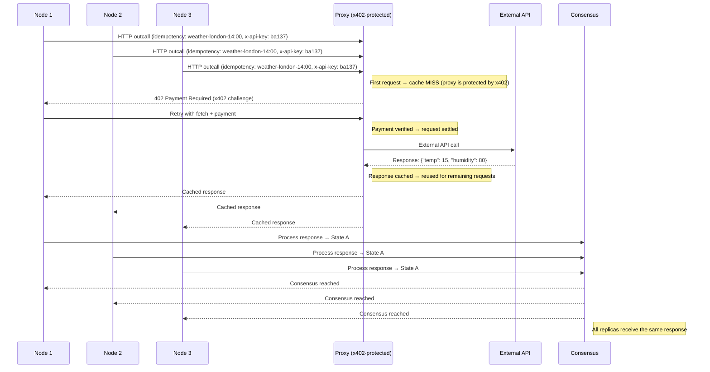

  <picture>
    <source srcset="assets/logo-dark.svg" media="(prefers-color-scheme: dark)">
    <source srcset="assets/logo-light.svg" media="(prefers-color-scheme: light)">
    
  </picture>

<h1 align="center">Consensus</h1>

  HTTP deduplication protocol with secure, verifiable payments via <strong>x402</strong> 
  HTTP as it should be for modern blockchains. Protect your APIs from the chaos of consensus

  
  
  
  

  • <a href="#">Docs</a> 
  • <a href="#">Demo</a> 
  • <a href="https://sepolia.basescan.org/address/0x32CfC8e7aCe9517523B8884b04e4B3Fb2e064B7f#tokentxns">Testnet Transactions</a>

## Overview

Blockchain consensus algorithms are powerful — but they come with baggage.

On the Internet Computer (ICP), for example, when an application subnet performs an HTTP outcall, **each node** in the subnet independently makes the request. These nodes run replicas, and the responses from the HTTP outcalls are compared in the consesus process. This means:

- The same HTTP request is made by the entire subnet (one from each node in the subnet — typically 13 in the case of ICP).
- Millisecond differences can lead to inconsistent responses.
- The **transform function** helps by sanitizing the responses, but it doesn’t reduce the number of actual requests.
- Each node makes the request from a **different physical machine**, which means **no shared IP address**, breaking determinism for services that rely on source identity.

This especailly becomes a problem when your target endpoint is **not idempotent**.

Even if all but one response is ignored, your service may still receive multiple requests — potentially triggering **duplicate processing**, **double charges**, or **conflicting writes**.

> With Consensus Proxy, only **1 request is executed** no matter how many are sent.
> In consensus-based systems like ICP, that means cutting traffic by up to **~93%**.
> In high-scale environments, it means **eliminating duplicate hits** that waste resources, blow past rate limits, or double-charge customers.

Whether your backend is behind a serverless API, rate-limited SaaS platform, or payment gateway, Consensus Proxy ensures **you pay once, process once — no matter how many nodes, retries, or consensus rounds are involved.**

---

### Consensus Proxy

Consensus Proxy solves this problem at the protocol level.

It acts as a **deduplication layer** that:

- Receives all node-originated requests
- Executes the request **exactly once**
- Caches and returns the same result to all participants
- Verifies **payment via `x402`**

## How it works

