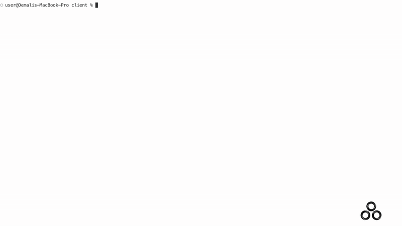

 <p align="center">
  
</p>
<h1 align="center">Consensus Client</h1>

<p align="center">
  CLI tool for setting up and managing access credentials for the Consensus protocol.<br>
  Creates a wallet, registers it, and generates your local configuration.<br>
</p>

<p align="center">
  <a href="#"></a>
  <a href="LICENSE"></a>
  <a href="https://github.com/Demali-876/consensus/stargazers">
    
  </a>
  <a href="#"></a>
</p>

## Setup Guide

Install the Consensus client library(NOT YET PUBLISHED):

```bash
npm install consensus
```

## Commands

These are the commands avaialable in the Consesnsus CLI:

|  Command                                                                     |  Description                                                   |
|---                                                                        |---                                                             |
| <kbd>setup</kbd>                                          | Create new account and register with `x402-proxy` |
| <kbd>setup --force</kbd>                                          | Force create new account (reset existing) |
| <kbd>help</kbd>                                          | Show help message |
